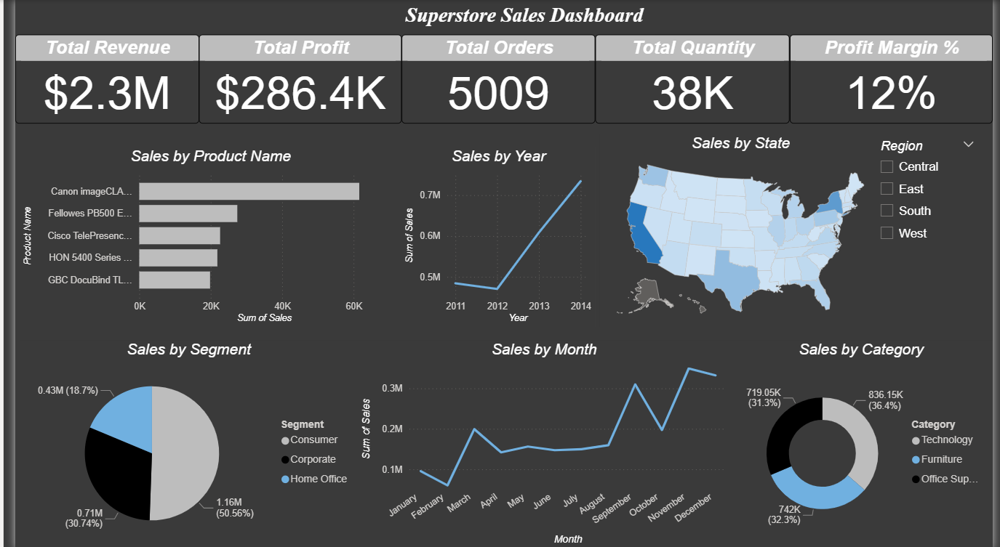

# Superstore Sales Dashboard

## 📌 Project Overview
This project presents a **Power BI interactive dashboard** built on the **Superstore Sales dataset** to analyze sales performance across various dimensions.  
The goal is to provide **actionable insights** into revenue, profitability, product performance, and regional trends to support data-driven decision-making.

---

## 📊 Key Metrics
The top KPI cards provide a quick snapshot of overall performance:
- **Total Revenue:** $2.3M  
- **Total Profit:** $286.4K  
- **Total Orders:** 5009  
- **Total Quantity:** 38K  
- **Profit Margin %:** 12%  

---

## 📈 Dashboard Visuals
1. **Sales by Product Name** – Horizontal bar chart showing sales volume by top products.  
2. **Sales by Year** – Line chart displaying sales growth trends over multiple years.  
3. **Sales by State** – Map visualization illustrating regional sales distribution across the U.S.  
4. **Sales by Segment** – Donut chart highlighting contributions from Consumer, Corporate, and Home Office segments.  
5. **Sales by Month** – Time-series line chart to identify seasonal patterns in sales.  
6. **Sales by Category** – Donut chart visualizing category-level performance: Technology, Furniture, and Office Supplies.  

---

## 🛠 Tools & Technologies
- **Power BI** for dashboard development and data visualization  
- **Power Query** for data cleaning and transformation  
- **DAX (Data Analysis Expressions)** for calculated measures  

---

## 🧹 Data Preparation
- Imported Superstore dataset (CSV format) into Power BI.  
- Cleaned and transformed data using **Power Query**.  
- Converted date fields to proper Date format for time-based analysis.  
- Created calculated measures for **Total Revenue**, **Total Profit**, and **Profit Margin** using **DAX**.  

---

## 🔍 Insights & Findings
- **Top Products:** Canon and Fellowes products generated the highest sales.  
- **Regional Performance:** East and West regions contributed the majority of revenue.  
- **Seasonality:** Sales peaked in **November and December**, indicating strong year-end demand.  
- **Segment Analysis:** Consumer segment led with **50.56% of total sales**, followed by Corporate and Home Office.  
- **Profit Margins:** Average profit margin across all categories was **12%**.  

---

## 🚀 How to Use
1. Open the `.pbix` file in **Power BI Desktop**.  
2. Refresh data sources if needed.  
3. Interact with filters and visuals to explore insights dynamically.  

---

## 🔮 Future Enhancements
- Add forecasting using Power BI's analytics pane.  
- Implement drill-through for detailed product-level analysis.  
- Integrate real-time sales data via APIs for dynamic updates.  

---

